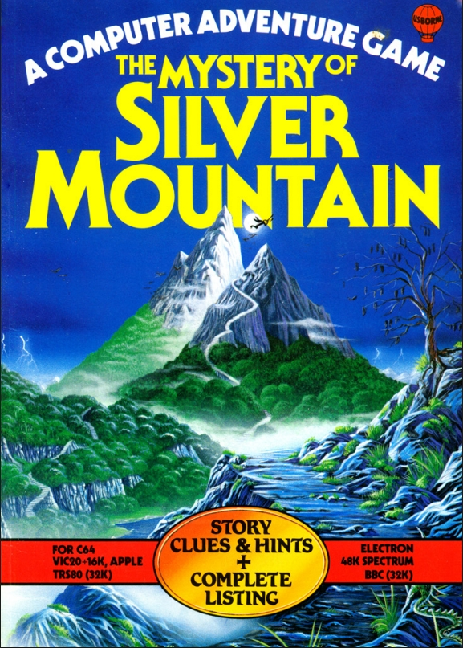
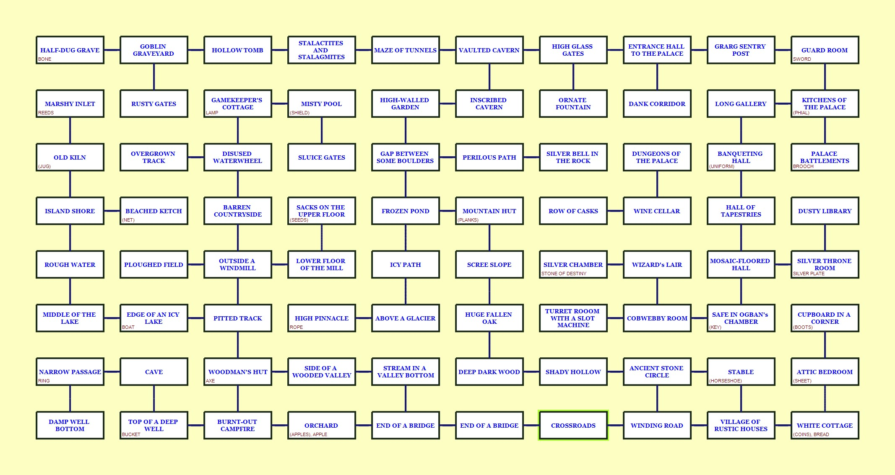

# The Mistery of Silver Mountain
Attempt to port 1984's **Chris Oxlade** &amp; **Judy Tatchell** / **Usborne Computer Guides** "**The Mistery of Silver Mountain**" to **StoryTllr** (my C64 text-graphic adventure engine)

[Link to original English book](https://dn790001.ca.archive.org/0/items/the-mystery-of-silver-mountain/the-mystery-of-silver-mountain.pdf)

## Why?

I was probably thirteen/fourteen when my parents gave me a copy of **The Mystery of Silver Mountain**. It was summer, and my younger brother and I typed that BASIC listing on a C64 with a green phosphor monitor on some hot afternoon before we could go play in the woods. It was probably one of the first text adventure games I fell in love with, accomplices also being the beautiful illustrations in the book, and the wonderful background story, which, in the game was recalled with just a few words, and without any graphics.
I thought about it a lot while making **Nesterin Trail**, and after looking around at some material I decided to try to make a porting of that masterpiece using StoryTllr64. Not a “simple” transposition (with the addition of some graphics), but a little something more -- adding descriptions and text where there were none for space reasons (the game had to run on multiple machines with little memory) -- but preserving the gameplay. That is, I want it to be possible to play this version identically to the original-including the possibility of dying on the fly, or making mistakes that will not allow the game to end. I mean, I want this version playable following this (guide)[https://solutionarchive.com/file/id%2C7197/] - that works with the original game.

It's not certain that I'll be able to do it (the original game code was deliberately cryptic, to avoid spoiling the surprises for those who copied the listing, and this adventure is "huge" – 80 locations and a staggering number of moves required to complete it), and it's also not certain that I'm even allowed to do it (having seen derivative works by others is not proof that this can be considered fair use).
But what drives me to at least begin is the desire to show those who never had the chance to experience the game in the 1980s the greatness of this work, by making it just a little more accessible, in the hope that it will help many others fall in love with the world of the Sylvanians.

All the material I create will be license-free. Here, the [StoryTllr](https://github.com/MGProduction/StoryTllrC64) source code for the entire project will be available – along with supporting material I will produce.

Special thanks go to these two repositories – [one](https://github.com/fivegreenapples/go-mountain) with a (working) Go conversion (which greatly helped me tackle the original code), and [one](https://github.com/Philbywhizz/SilverMountain) with a conversion in Inform7 (only structural, without gameplay).

## Game-map

The first thing I needed was a full map of the game, not just to reproduce it inside a StoryTllr source file, but also to **see** it, while I try to port the cryptic original code to mine. So I "converted" the DATA section in a .trizbort [file](_pub/TheMysteryOfSilverMountain.trizbort) then I've rendered it in jpeg

I've also added in the map the names of the objects that are present in each location (the one with parenthesis around are the one hidden at start). This will not include what's set in the code, but it's a start.
