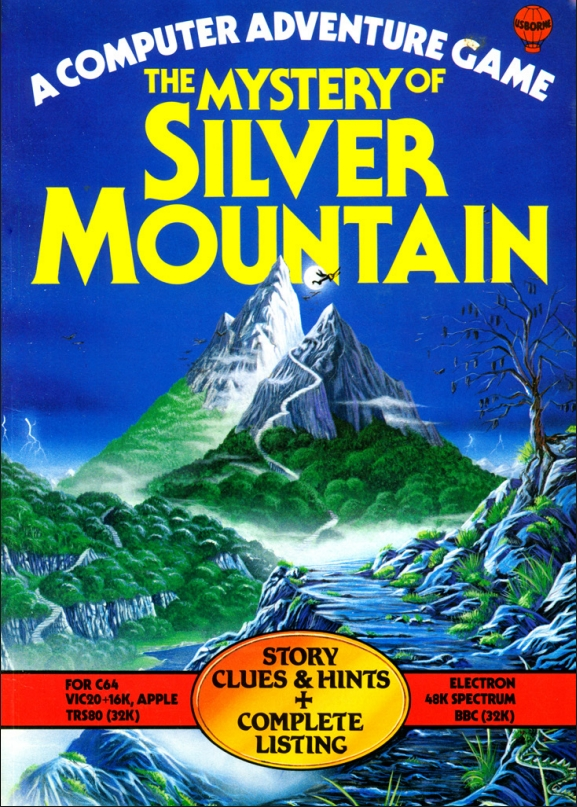
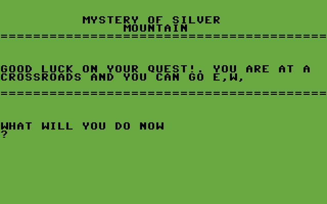
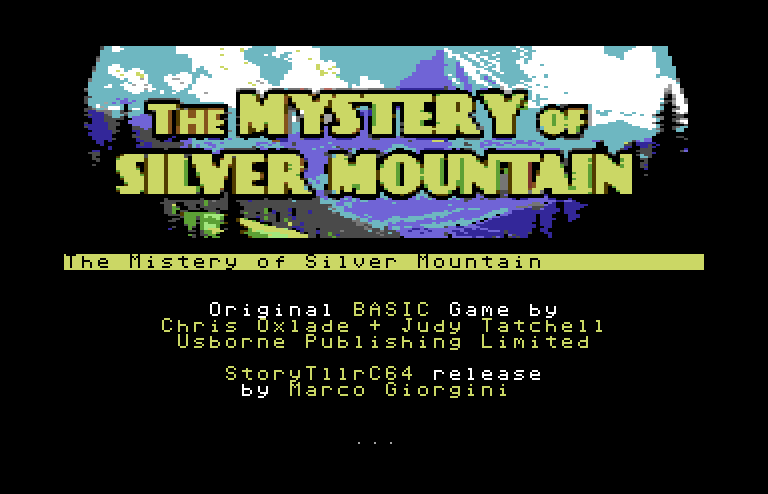
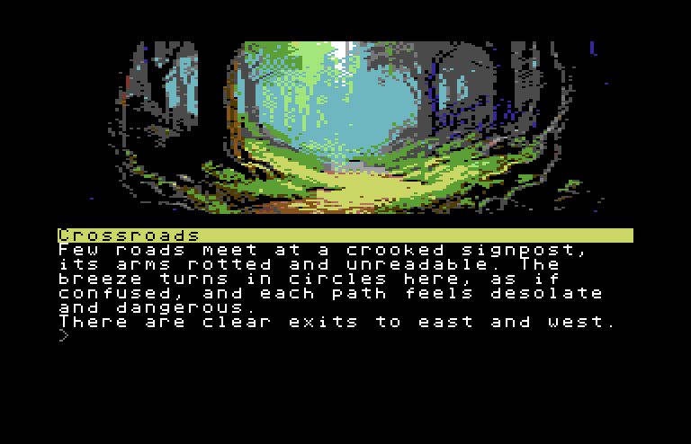
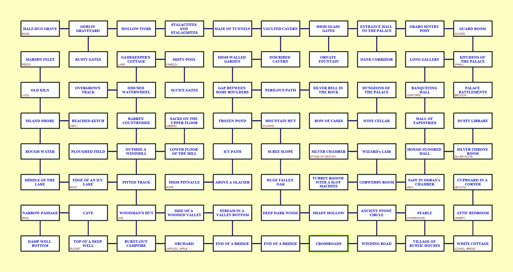
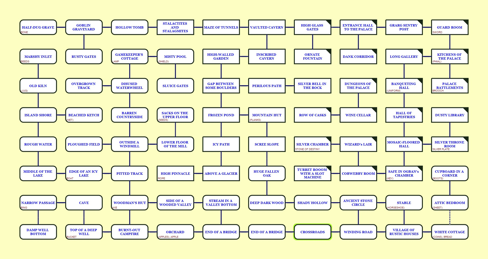

# The Mistery of Silver Mountain

This is a tribute to **1984**'s **Usborne** BASIC text-adventure masterpiece, called **The Mystery of Silver Mountain**. The original game (by **Chris Oxlade** &amp; **Judy Tatchell** for **Usborne Computer Guides**), whose source code was inside a wonderful book sold then, was one reason for my love for this kind of game. Despite being a huge and long adventure, being designed for multiple 8-bit computers its descriptions and gameplay were "essential" making it even harder to solve than it was planned to be (being also some clues present only in the physical book, now not on the market anymore).

So I decided to create a remake - adding extra text and graphics - and publish the new source code (**StoryTllr64** scripts) to help check it in these different "clothes", to highlight the greatness of the original work.

This complete project is freely available here on **GitHub**. If you like it please share your appreciation for the original authors and their publisher.

Disclaimer: In-game graphics are based on pictures/drawings (mine or friends' ones), assembled stock images, but some also on generated images. I edited every one of them (and converted them for C64).

## The Book

[Link to original English book](https://dn790001.ca.archive.org/0/items/the-mystery-of-silver-mountain/the-mystery-of-silver-mountain.pdf)

## The C64 (original) game

## The C64 (new) game

## Why?

I was probably thirteen/fourteen when my parents gave me a copy of **The Mystery of Silver Mountain**. It was summer, and my younger brother and I typed that BASIC listing on a C64 with a green phosphor monitor on some hot afternoon before we could go play in the woods. It was probably one of the first text adventure games I fell in love with, accomplices also being the beautiful illustrations in the book, and the wonderful background story, which, in the game was recalled with just a few words, and without any graphics.
I thought about it a lot while making **Nesterin Trail**, and after looking around at some material I decided to try to make a porting of that masterpiece using StoryTllr64. Not a “simple” transposition (with the addition of some graphics), but a little something more -- adding descriptions and text where there were none for space reasons (the game had to run on multiple machines with little memory) -- but preserving the gameplay. That is, I want it to be possible to play this version identically to the original-including the possibility of dying on the fly, or making mistakes that will not allow the game to end. I mean, I want this version playable following this [guide](https://solutionarchive.com/file/id%2C7197/) - that works with the original game.

It's not certain that I'll be able to do it (the original game code was deliberately cryptic, to avoid spoiling the surprises for those who copied the listing, and this adventure is "huge" – **80 locations** and a staggering number of moves required to complete it).
My first goal is to release **a working game featuring a part of this large adventure** - with at least three-quarters of the locations (at the moment we can reach the **Entrance hall to the palace** - just after passing the hound at the gates).

**new** I've created a working C version of the original game (https://github.com/MGProduction/The-Mistery-of-Silver-Mountain-C-version) so to have a sure and quick way to check if everything is faithful with the original version.

## Notes & Thanks

All the material I create for this project will be free and the [StoryTllr](https://github.com/MGProduction/StoryTllrC64) source code for the entire project will be available – along with supporting material I will produce. Please be aware that I'm creating a derivative work on **Chris Oxlade** + **Judy Tatchell** + **Usborne Computer Guides** original material so I, of course, cannot really license anything.

Special thanks go to these two repositories – [one](https://github.com/fivegreenapples/go-mountain) with a (working) Go conversion (which greatly helped me tackle the original code), and [one](https://github.com/Philbywhizz/SilverMountain) with a conversion in Inform7 (only structural, without gameplay).

## Game-map

The first thing I needed was a full map of the game, not just to reproduce it inside a StoryTllr source file, but also to **see** it, while I try to port the cryptic original code to mine. So I "converted" the DATA section in a .trizbort [file](_pub/TheMysteryOfSilverMountain.trizbort) then I've rendered it in jpeg

I've also added the names of the objects present in each location to the map (the ones with parenthesis around are the ones hidden at the start). This will not include what's set in the code, but it's a start.

## WIP status

This is the current status: rounded rooms are the ones available at the moment (even if not everyone is fully playable, and all of them have just some minimal enrichment - longer description, graphics, some extra synonyms for already handled actions)

At the moment it's possible to follow the solution's guide steps up to ééEntrance hall to the palace** with some minor flaws (so it's not far from a first release - even if "not far" can still mean 'weeks')

Changes compared to the original game: 
- **Maze of Tunnels**: in the original game, you needed to write down a path and use it to exit the maze. I've kept the necessity to find that information, but once you find it, that puzzle is 'solved' in an automatic way, without the need to insert the exact sequence
- **Silver bell in the rocks**: (not yet implemented) this puzzle will be handled in the same way. You need to find a clue, once you find it, you don't have to write it down and insert it when prompted.
- **Frozen pond**: this is the only 'you're automatically dead' element I've decided to let you escape from (you can backtrack to the Mountain Hut)

Once ready also the .d64 will be added to this page (and it will be present also a page about this demo on itch.io)
